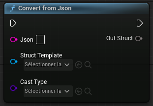

# What is this?
This repo contains a barebones Unreal Engine project intended as a proof-of-concept for an easy to use JSON encode / decode nodes.
This lets a blueprint programmer to parse any JSON string into a blueprint defined struct.

## Note :
The cast type pin is useless and should be removed in a good implementation
